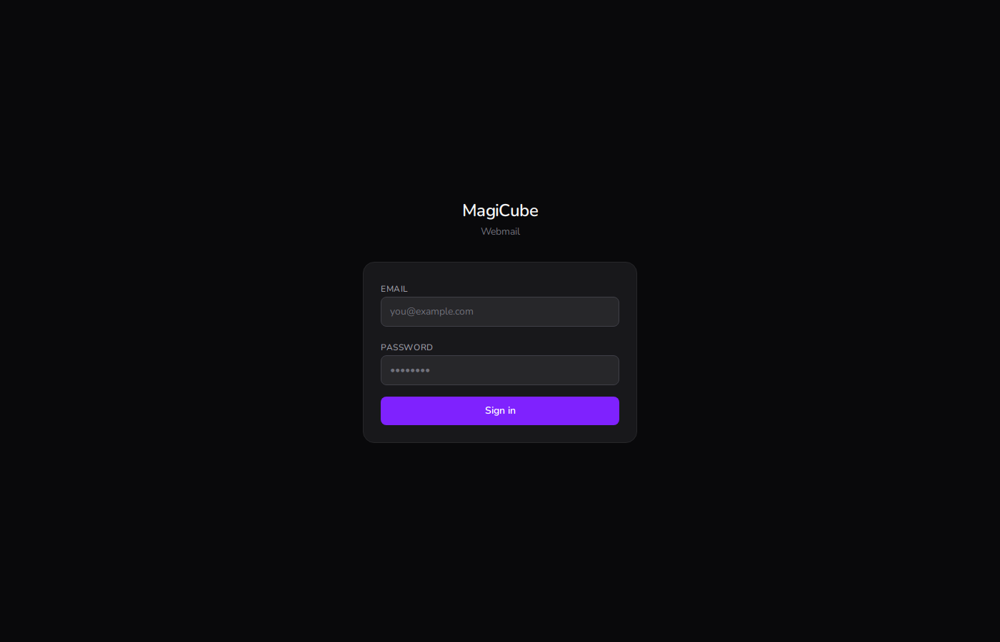
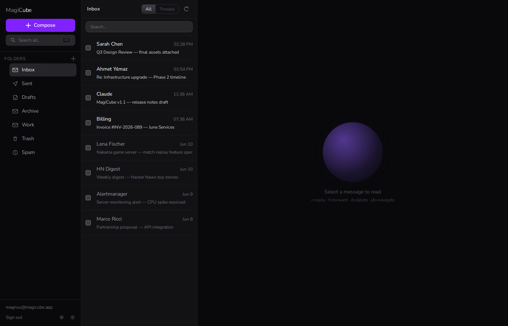
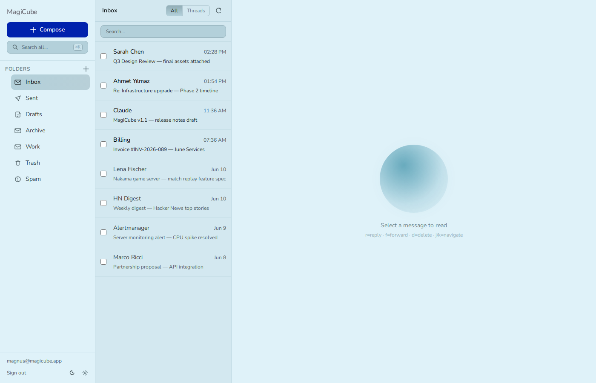
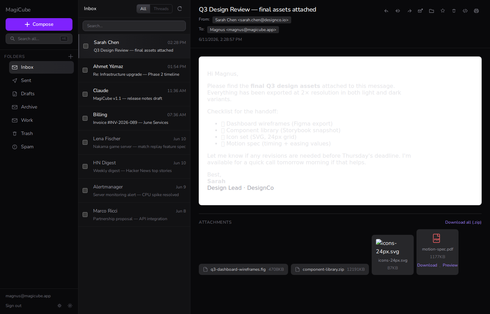
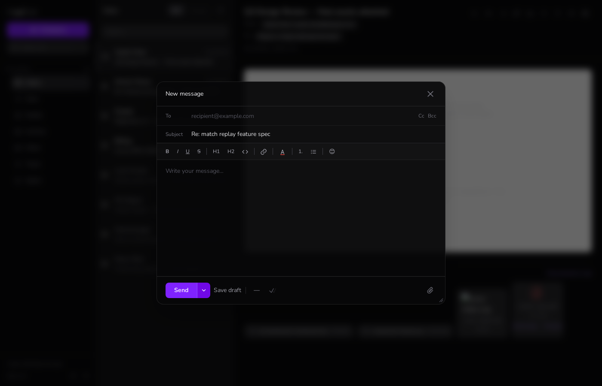
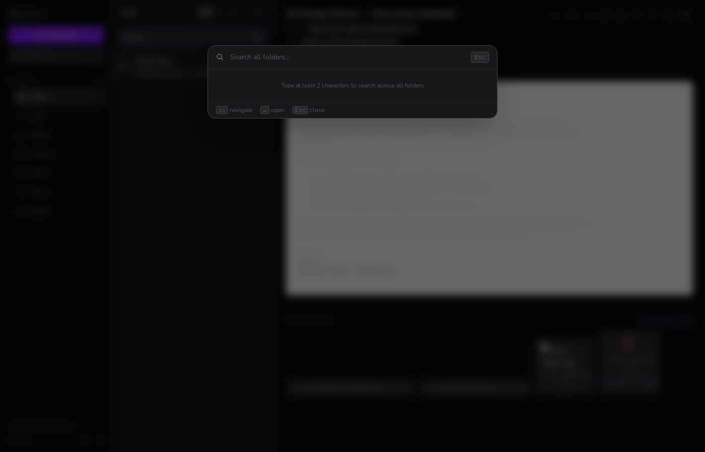
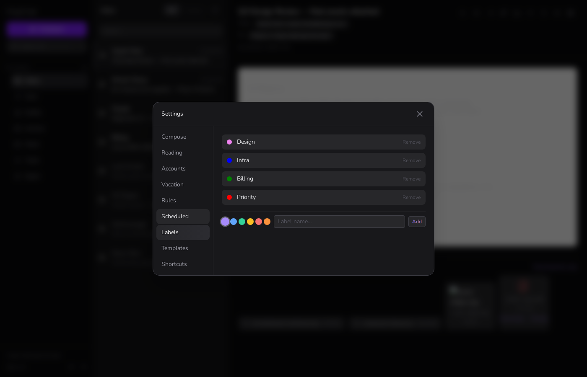
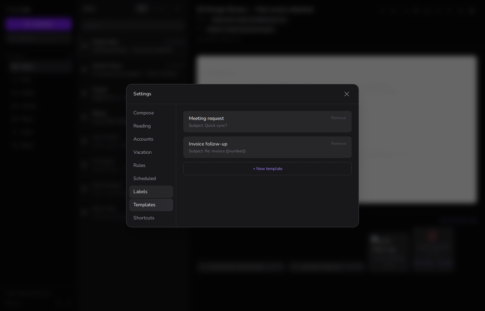

<div align="center">

# MagiCube

**A self-hosted, privacy-first webmail client.**  
Built with React 19, Express, and real IMAP/SMTP — no third-party services, no tracking, no data leaving your server.

[](LICENSE)
[](https://nodejs.org)
[](https://react.dev)
[](https://vitejs.dev)
[](https://tailwindcss.com)

**[Live demo →](https://magicube.magnusmagi.com)**

</div>

---

## What is MagiCube?

MagiCube is a full-stack webmail client designed to be deployed alongside [Mailcow](https://mailcow.email/) or any standard IMAP/SMTP server. It provides a fast, keyboard-driven interface with a dark zinc UI, animated micro-interactions, real-time push notifications, and a rich compose experience — all in a single Node.js process with no database required.

```
Browser  ←──HTTPS──→  Express (server.js)  ←──IMAP/SMTP──→  Mailcow / Mail Server
                            │
                        Session Auth
                        AES-256-GCM
                        IMAP IDLE Push
                        Rate Limiting
```

---

## Screenshots

| Login | Inbox (dark) | Inbox (light) |
|-------|-------------|---------------|
|  |  |  |

| Message view | Compose | Global search |
|-------------|---------|---------------|
|  |  |  |

| Settings → Labels | Settings → Templates |
|------------------|---------------------|
|  |  |

---

## Features

### Mail Reading

- **IMAP folder tree** — all mailboxes listed in the sidebar with live unread counts
- **Thread grouping** — toggle between flat list and conversation threads (grouped by normalized subject, strips Re:/Fwd: chains)
- **Per-folder search** — IMAP search with 400 ms debounce on subject and sender
- **Cross-folder global search** — `⌘K` modal searches subject, sender, and body across all folders simultaneously
- **HTML + plain text rendering** — automatic fallback, sanitized iframe rendering for HTML bodies
- **External image blocking** — remote images hidden by default with a "Show images" reveal button
- **Auto-mark as read** — configurable; marks the active message on open
- **Server-side address book** — From/To/Cc addresses auto-saved to the server (rolling 500-contact window, persists across devices)
- **PDF & image attachment preview** — inline image lightbox, PDF icon with direct download link
- **Bulk zip download** — download all attachments in a single `.zip` when a message has multiple files
- **Print view** — clean print layout via browser print dialog
- **Raw source view** — toggle original MIME source for debugging
- **Keyboard navigation** — `j/k` or `↓/↑` to move between messages without touching the mouse
- **Bulk operations** — checkbox-select multiple messages, bulk mark read/unread, bulk delete

### Real-Time Notifications

- **IMAP IDLE push** — dedicated IMAP connection per session using the `EXISTS` event; new mail detected in near real-time without polling
- **In-app toast** — animated slide-up toast shows sender name and subject when new mail arrives
- **Browser notification** — native OS notification via the Web Notifications API (permission requested on first new mail)
- **Tab title badge** — browser tab shows `(N) MagiCube` with total unread count

### Compose

- **Rich text editor** — `contentEditable`-based with full formatting toolbar:
  - **Bold**, *Italic*, <u>Underline</u>, ~~Strikethrough~~
  - Heading 1 & 2, Code block (`<pre>`)
  - Ordered and unordered lists
  - Hyperlink insertion with URL prompt
  - **Text color picker** — 6 colors: default / red / orange / green / blue / purple
- **Emoji picker** — 48 curated emojis; popup grid attached to toolbar button
- **Mail templates** — save and reuse compose templates (subject + body); managed in Settings → Templates
- **Inline image paste** — paste images from clipboard directly into the message body
- **Drag & drop attachments** — drag files onto the compose window; animated drop-zone overlay appears
- **File attachments** — attach multiple files, shows filename + KB size, remove individually
- **CC / BCC** — toggle-show extra address fields, contact autocomplete in all address inputs
- **Contact autocomplete** — fuzzy name + address matching from the server-side address book
- **Priority flag** — click to cycle Normal `—` / High `!` / Low `↓`; header badge shown on High
- **Read receipt** — double-tick icon toggle; flag added to the outgoing message headers
- **Word count** — live word counter updates in the footer as you type
- **Undo send** — 10-second countdown toast after clicking Send; cancel before actual delivery
- **Scheduled send** — datetime picker to queue delivery for a future time
- **Save draft** — manual save to Drafts folder
- **Auto-save draft** — silent background save every 30 seconds when the compose window is dirty
- **Keyboard shortcut** — `Cmd/Ctrl + Enter` to send from anywhere inside the compose window
- **Resizable window** — drag the bottom-right handle to any size

### Organisation

- **Custom labels** — create color-coded labels (up to 20) and assign them to messages; managed in Settings → Labels
- **Inbox rules** — server-side filter rules: if `from/to/subject` `contains/equals/starts-with/ends-with` → `move/flag/mark-read/delete`
- **Folder management** — create, rename, delete custom IMAP folders directly from the sidebar
- **Drag-to-reorder folders** — drag sidebar folders into any order; order persists in localStorage
- **Vacation auto-reply** — configurable subject, body, and active date range

### Settings (9 tabs)

| Tab | Options |
|-----|---------|
| **Compose** | Display name (shown in From), email signature (auto-appended to new messages) |
| **Reading** | Block external images toggle, auto-mark-as-read toggle, messages per page (25 / 50 / 100) |
| **Accounts** | Add / remove IMAP accounts; credentials encrypted with AES-256-GCM before storage |
| **Vacation** | Auto-reply message with subject, body, active date range, and on/off toggle |
| **Rules** | Inbox filter rules — condition + action pairs |
| **Scheduled** | View and cancel messages queued for future delivery |
| **Labels** | Create, color-pick, and remove custom message labels |
| **Templates** | Save reusable compose templates with name, subject, and body |
| **Shortcuts** | Keyboard shortcut reference card |

### Keyboard Shortcuts

| Key | Action |
|-----|--------|
| `r` | Reply |
| `a` | Reply All |
| `f` | Forward |
| `d` | Delete message |
| `u` | Mark as unread |
| `j` / `↓` | Next message |
| `k` / `↑` | Previous message |
| `⌘K` / `Ctrl+K` | Open global search |
| `Esc` | Close compose / settings / search |
| `Cmd+Enter` | Send (inside compose) |

---

## Stack

### Frontend

| Package | Version | Role |
|---------|---------|------|
| React | 19 | UI framework |
| Vite | 8 | Build tooling & HMR dev server |
| Tailwind CSS | 4 | Utility-first styling (CSS-native engine, no PostCSS config) |
| GSAP | 3 | Panel slide transitions & animation timelines |
| Motion | 12 | Spring-physics list entry animations |

### Backend

| Package | Role |
|---------|------|
| Express | HTTP server, session middleware, REST API routing |
| ImapFlow | IMAP client — list, fetch, flags, IDLE, move, delete |
| Nodemailer | SMTP send via `MailComposer` |
| mailparser | Full MIME parsing — attachments, HTML/plain, address objects |
| multer | Multipart/form-data for file attachment uploads |
| archiver | On-the-fly ZIP generation for bulk attachment downloads |
| express-session | Session cookie management |
| express-rate-limit | Per-IP throttling on auth and send endpoints |

### Security

- **AES-256-GCM** — IMAP credentials encrypted at rest using a key derived from `SESSION_SECRET`; IV and auth tag stored alongside ciphertext; never stored in plaintext
- **Session cookies** — `httpOnly: true`, `sameSite: 'lax'`, `secure: true` in production
- **Rate limiting** — auth endpoint: 10 requests / 15 min; send endpoint: 20 requests / 15 min
- **No third-party services** — all mail flows through your own IMAP/SMTP server, zero external API calls
- **External image blocking** — default-on blocks tracking pixels and arbitrary remote fetches

---

## Architecture

```
magicube/
├── server.js              # Express backend — IMAP/SMTP proxy, session auth, REST API
├── ecosystem.config.js    # PM2 process configuration
├── data/                  # Persistent server-side storage (flat JSON, no database)
│   ├── accounts.enc       # Encrypted IMAP accounts (AES-256-GCM)
│   ├── vacation.json      # Auto-reply config per user
│   ├── rules.json         # Inbox filter rules per user
│   ├── contacts.json      # Server-side address book per user
│   ├── labels.json        # Label assignments per message per user
│   ├── label-defs.json    # Label definitions (name + color) per user
│   ├── templates.json     # Compose templates per user
│   └── queue.json         # Scheduled send queue
└── client/                # React frontend (Vite build → ../public/)
    ├── src/
    │   ├── App.jsx            # Root layout, panel state machine, GSAP transitions
    │   ├── api/
    │   │   └── mail.js        # Fetch wrapper for all REST endpoints
    │   ├── hooks/
    │   │   ├── useAuth.js     # Session state, login/logout
    │   │   └── useMail.js     # useMessages + useMessage with AbortController cleanup
    │   └── components/
    │       ├── Login.jsx          # Auth form with ClickSpark animation on submit
    │       ├── Sidebar.jsx        # IMAP folder tree, SSE connection, compose/search triggers
    │       ├── MessageList.jsx    # Paginated list, thread grouping, search, bulk ops
    │       ├── MessageView.jsx    # HTML iframe renderer, attachment gallery, reply/forward
    │       ├── Compose.jsx        # Rich compose window (full feature set — see above)
    │       ├── Settings.jsx       # 9-tab settings panel
    │       ├── GlobalSearch.jsx   # Cross-folder ⌘K search modal
    │       ├── Toast.jsx          # Animated toast notification container
    │       └── bits/              # Animated UI primitives (no dependencies beyond GSAP/Motion)
    │           ├── AnimatedList.jsx
    │           ├── BlurText.jsx
    │           ├── ClickSpark.jsx
    │           ├── CountUp.jsx
    │           ├── DecryptedText.jsx
    │           ├── FadeContent.jsx
    │           ├── Orb.jsx
    │           ├── ShinyText.jsx
    │           └── SpotlightCard.jsx
    └── public/            # Built static assets served by Express
```

---

## API Reference

### Auth

| Method | Path | Description |
|--------|------|-------------|
| `POST` | `/auth/login` | Login with IMAP credentials (rate-limited: 10 req/15 min) |
| `POST` | `/auth/logout` | Destroy session |
| `GET`  | `/auth/me` | Return current session user |

### Messages

| Method | Path | Description |
|--------|------|-------------|
| `GET`    | `/api/messages` | Paginated list — `?folder=&page=&limit=&search=` |
| `GET`    | `/api/messages/:uid` | Full message with parsed body and attachment list |
| `GET`    | `/api/messages/:uid/source` | Raw MIME source text |
| `GET`    | `/api/messages/:uid/attachment/:index` | Download single attachment by index |
| `GET`    | `/api/messages/:uid/attachments.zip` | Download all attachments as a ZIP |
| `PATCH`  | `/api/messages/:uid/flags` | Add/remove IMAP flags (`\Seen`, `\Flagged`, …) |
| `PATCH`  | `/api/messages/:uid/labels` | Assign/remove custom labels |
| `DELETE` | `/api/messages/:uid` | Move to Trash or permanent delete |
| `POST`   | `/api/messages/:uid/move` | Move to another folder |
| `PATCH`  | `/api/bulk/flags` | Bulk flag update for multiple UIDs |
| `DELETE` | `/api/bulk` | Bulk delete for multiple UIDs |

### Sending

| Method | Path | Description |
|--------|------|-------------|
| `POST`   | `/api/send` | Send message — `multipart/form-data` with optional `attachments[]` (rate-limited) |
| `POST`   | `/api/draft` | Save message to Drafts folder |
| `GET`    | `/api/queue` | List scheduled messages |
| `POST`   | `/api/queue` | Schedule a message for future delivery |
| `DELETE` | `/api/queue/:id` | Cancel a scheduled message |

### Search & Folders

| Method | Path | Description |
|--------|------|-------------|
| `GET`    | `/api/search?q=` | Cross-folder search — subject, sender, body |
| `GET`    | `/api/folders` | List folders with unread counts |
| `POST`   | `/api/folders` | Create a new folder |
| `PATCH`  | `/api/folders/rename` | Rename a folder |
| `DELETE` | `/api/folders/:path` | Delete a folder |
| `DELETE` | `/api/folders/empty` | Empty Trash or Spam |

### Contacts, Labels & Templates

| Method | Path | Description |
|--------|------|-------------|
| `GET` / `POST` | `/api/contacts` | List or add contacts |
| `DELETE` | `/api/contacts/:id` | Remove a contact |
| `GET` / `PUT` | `/api/label-defs` | Get or replace label definitions |
| `GET`    | `/api/labels` | Get all label assignments |
| `GET` / `POST` | `/api/templates` | List or create compose templates |
| `DELETE` | `/api/templates/:id` | Delete a template |

### Settings & Real-time

| Method | Path | Description |
|--------|------|-------------|
| `GET` / `PUT` | `/api/vacation` | Get or set vacation auto-reply config |
| `GET` / `PUT` | `/api/rules` | Get or replace inbox filter rules |
| `GET` / `POST` / `DELETE` | `/api/accounts(/:index)` | Manage IMAP accounts |
| `POST` | `/api/accounts/:index/switch` | Switch active account |
| `GET`  | `/api/sse` | Server-Sent Events — folder counts + new mail push |

---

## Setup

### Prerequisites

- Node.js 20+
- PM2 (`npm i -g pm2`)
- An IMAP/SMTP server — [Mailcow](https://mailcow.email/) on the same network works perfectly

### Quick Start

```bash
git clone https://github.com/MagnusMagi/MagiCube.git
cd MagiCube

# 1. Install backend dependencies
npm install

# 2. Build the frontend
cd client && npm install && npm run build && cd ..

# 3. Set your session secret
export SESSION_SECRET=$(node -e "console.log(require('crypto').randomBytes(32).toString('hex'))")

# 4. Start
node server.js
# → http://localhost:8891
```

### Environment Variables

| Variable | Required | Default | Description |
|----------|----------|---------|-------------|
| `SESSION_SECRET` | ✅ | — | 32+ byte random hex — used as AES-256-GCM key for credential encryption |
| `PORT` | — | `8891` | HTTP port Express listens on |
| `IMAP_HOST` | — | `172.30.1.250` | IMAP server hostname or IP |
| `IMAP_PORT` | — | `993` | IMAP port (TLS) |
| `SMTP_HOST` | — | `172.30.1.253` | SMTP server hostname or IP |
| `SMTP_PORT` | — | `587` | SMTP port (STARTTLS) |

Generate a session secret:

```bash
node -e "console.log(require('crypto').randomBytes(32).toString('hex'))"
```

### Production with PM2

```bash
pm2 start ecosystem.config.js
pm2 save && pm2 startup
```

### Reverse Proxy

**Caddy:**
```
magicube.example.com {
    reverse_proxy localhost:8891
}
```

**Nginx:**
```nginx
server {
    listen 443 ssl;
    server_name magicube.example.com;

    # Required for SSE push notifications — disable proxy buffering
    proxy_buffering off;
    proxy_set_header X-Accel-Buffering no;

    location / {
        proxy_pass http://localhost:8891;
        proxy_set_header Upgrade $http_upgrade;
        proxy_set_header Connection 'upgrade';
        proxy_set_header Host $host;
    }
}
```

### Development Mode

```bash
# Terminal 1 — backend
node --watch server.js

# Terminal 2 — frontend with HMR (proxies /api/* to :8891)
cd client && npm run dev
```

---

## Data Storage

All persistent data lives in `data/` as flat JSON files (encrypted where sensitive). No database required.

| File | Contents |
|------|----------|
| `accounts.enc` | IMAP accounts — AES-256-GCM encrypted per entry |
| `vacation.json` | Auto-reply config per user |
| `rules.json` | Inbox filter rules per user |
| `contacts.json` | Server-side address book — rolling 500-contact window per user |
| `labels.json` | Label assignments per message per user |
| `label-defs.json` | Label definitions (name + color) per user |
| `templates.json` | Compose templates per user |
| `queue.json` | Scheduled send queue — passwords AES-encrypted |

Session state (including the per-user IMAP connection) lives in memory. When the server restarts, users are prompted to log in again — no tokens persist between restarts.

---

## Design System

MagiCube uses a custom zinc-based dark theme built on Tailwind CSS v4 (CSS-native engine, no PostCSS config required). A light mode is available via the toggle in the sidebar footer.

| Token | Value | Usage |
|-------|-------|-------|
| App background | `zinc-950` | Outermost shell |
| Panel surface | `zinc-900` | Sidebars, modals |
| Card surface | `zinc-800` | Input fields, attachment chips |
| Divider | `zinc-800/60` | Borders, separators |
| Muted text | `zinc-500` | Labels, timestamps, placeholders |
| Body text | `zinc-300` | Message content |
| Primary text | `zinc-100` | Headings, active items |
| Active gradient | `from-zinc-700 to-zinc-800` | Selected list items, active tabs |
| Accent | `violet-500/600` | Focus rings, toggles, send button |
| Warning | `red-400` | High priority badge, error states |

Animation libraries are used intentionally — each has a specific role:
- **GSAP** handles panel slide-in/out transitions (precise easing, interruption-safe)
- **Motion** handles list item entry (spring physics via `AnimatePresence`)
- **CSS `transition-*`** handles simple hover/focus state changes and theme switching

---

## Troubleshooting

**IMAP connection fails at login**
- Verify `IMAP_HOST` and `IMAP_PORT` are reachable from the server — if Mailcow runs in Docker, use the container's internal IP, not `localhost`
- Confirm port 993 is open and TLS is enabled on the mail server

**Session expires immediately**
- `SESSION_SECRET` must be set and stable — changing it invalidates all existing sessions
- Check that your reverse proxy passes cookies correctly

**Push notifications not firing**
- SSE (`/api/sse`) must not be buffered by your reverse proxy — add `proxy_buffering off` in Nginx (see Nginx config above)
- Browser notifications require HTTPS and explicit user permission

**Scheduled messages not sending**
- The queue processor runs every 60 seconds; messages won't send if the server is down at the scheduled time
- Check logs: `pm2 logs magicube`

**Attachments fail to download**
- The session must still be valid — attachment endpoints require authentication
- Large attachments (>25 MB) are rejected by multer — adjust the limit in `server.js` if needed

**Frontend not loading after build**
- Ensure the Vite build output goes to `../public/` (relative to `client/`) — Express serves from that path
- Verify `public/index.html` exists after `npm run build`

---

## Comparison

| Feature | MagiCube | Roundcube | Rainloop |
|---------|----------|-----------|----------|
| Self-hosted | ✅ | ✅ | ✅ |
| No database required | ✅ | ❌ (MySQL/PG) | ✅ |
| Real-time push (IMAP IDLE) | ✅ | ❌ | ❌ |
| Rich text compose | ✅ | ✅ | ✅ |
| Scheduled send | ✅ | ❌ | ❌ |
| Cross-folder search | ✅ | ✅ | ✅ |
| Keyboard-first navigation | ✅ | Partial | ❌ |
| Custom labels | ✅ | ❌ | ❌ |
| Mail templates | ✅ | Plugin | ❌ |
| Undo send | ✅ | ❌ | ❌ |
| Modern React UI | ✅ | ❌ | ❌ |

---

## Roadmap

- [ ] S/MIME and PGP end-to-end encryption
- [ ] Multi-account unified inbox view
- [ ] vCard / ICS contact and calendar import
- [ ] Mobile PWA with offline support
- [ ] Persistent sessions across server restarts (file-backed session store)
- [ ] Docker Compose deployment
- [ ] Webhook / notification integrations (Telegram, Slack)

---

## Contributing

Pull requests are welcome. For significant changes, please open an issue first to discuss the approach.

### Local setup

```bash
git clone https://github.com/MagnusMagi/MagiCube.git
cd MagiCube
npm install
cd client && npm install && cd ..

export SESSION_SECRET=dev-secret-change-in-production

# Terminal 1 — backend (port 8891)
node server.js

# Terminal 2 — frontend dev server (port 5173, proxies /api to 8891)
cd client && npm run dev
```

### Conventions

- Backend: CommonJS (`require`), no TypeScript
- Frontend: ESModules + JSX, Tailwind utility classes
- Commit messages follow [Conventional Commits](https://www.conventionalcommits.org/)

---

## Changelog

### v1.1.0

- Real-time IMAP IDLE push notifications via SSE
- In-app toast + browser Notification API on new mail
- `⌘K` cross-folder global search modal
- Browser tab unread count badge `(N) MagiCube`
- Settings → Scheduled: view and cancel queued messages
- Settings → Labels: custom color-coded message labels
- Settings → Templates: reusable compose templates
- Server-side address book (replaces localStorage-only contacts)
- Bulk attachment ZIP download
- Print view support
- Smooth theme transition animation
- New API endpoints: `/api/search`, `/api/contacts`, `/api/labels`, `/api/templates`, `/api/messages/:uid/attachments.zip`

### v1.0.0

- Initial release — IMAP/SMTP proxy, rich compose, folder management, vacation auto-reply, inbox rules, keyboard shortcuts

---

## License

MIT — see [LICENSE](LICENSE)
